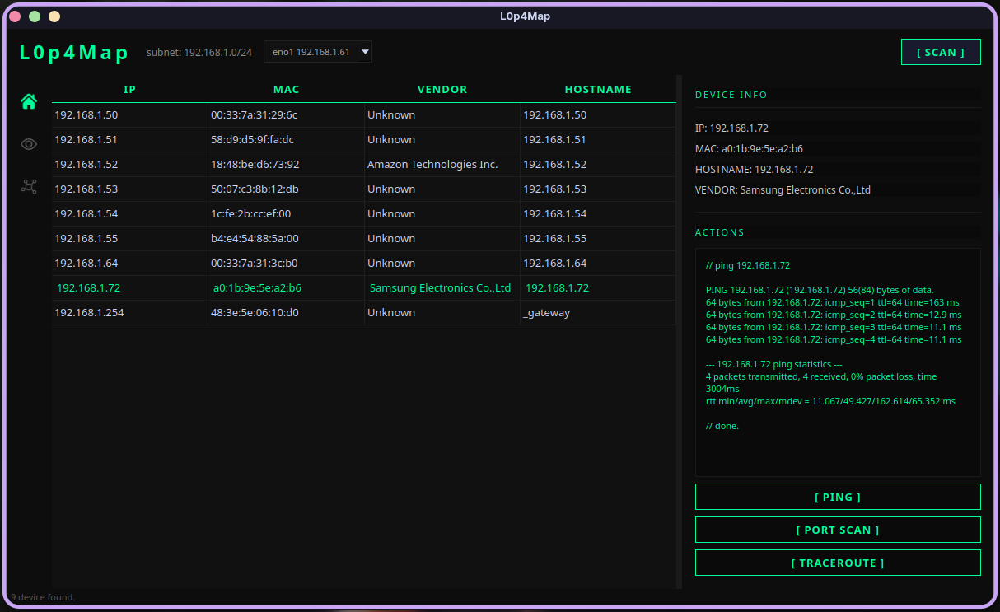
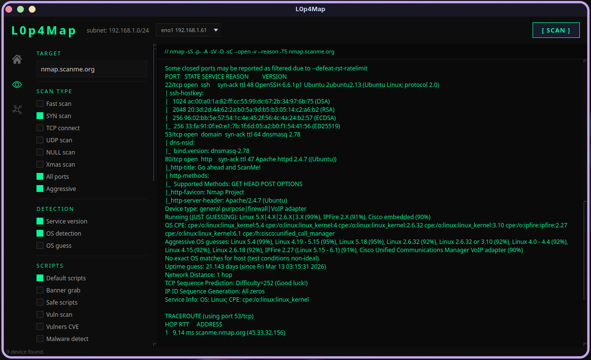
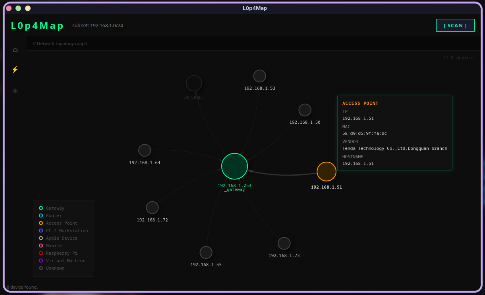

<div align="center">

# L0p4Map
**Nmap was blind. L0p4Map sees.**


Professional network monitoring & visualization tool built for security researchers.

https://github.com/user-attachments/assets/8ca3b579-8028-4cfb-a54b-1c83269322cb

</div>

---

## What is L0p4Map? 👁️

L0p4Map is a professional-grade network monitoring tool that combines the power of nmap with a clean, modern dark UI. Designed for security researchers and network administrators who need fast, detailed visibility into their infrastructure.

No bloat. No BS. Just raw network intelligence.

---

## Features

- **ARP Network Scan** — fast host discovery with local IEEE OUI database lookup and API fallback
- **Hostname Resolution** — multi-method detection via reverse DNS, NetBIOS (Windows devices) and mDNS/Avahi (Linux, Mac, IoT)
- **Full nmap Integration** — SYN scan, UDP, OS detection, service version, NSE scripts
- **Banner Grabbing** — HTTP, SMB, FTP, SSH, SSL enumeration
- **Vulnerability Detection** — CVE lookup via vulners, vuln scripts, malware detection
- **Traceroute** — ICMP-based with real-time output
- **Dark Professional UI** — built with PyQt6, designed for researchers
- **Network Graph** — interactive topology visualization via vis.js
- **Interface Selection** — choose which network interface to scan on
- **Scan Export** — save full nmap output to `.txt` via native file manager dialog
- **Graph Export** — export the network topology as CSV or PNG
- **Live Monitoring** — auto-refresh the network graph at configurable intervals (30s / 60s / 120s)

## 🚧 Upcoming Features

- **Custom Node Labels** — assign custom names to devices directly from the graph
- **Graph Persistence** — save and reload network topologies
- **Change Detection** — highlight new or disappearing devices on the network

---

## Screenshots

### Home — Network Scanner


### Port Scan — Full nmap Integration


### Network Topology — Interactive network topology graph


---

## Requirements

- Linux (Debian or Arch)
- Python 3.11+
- nmap installed (`sudo pacman -S nmap` or `sudo apt install nmap`)
- Root privileges (required for ARP scanning)

---

## Installation
```bash
git clone https://github.com/HaxL0p4/L0p4Map.git
cd L0p4Map
pip install -r requirements.txt
sudo chmod +x L0p4Map.sh
```

---

## Usage

Launch the tool with root privileges:
```bash
sudo ./L0p4Map.sh
```

1. Select the network interface from the toolbar dropdown
2. Press **[ SCAN ]** to discover all devices on your network
3. Click a device to see details and run quick actions (ping, traceroute)
4. Press **[ PORT SCAN ]** to open the full nmap scan interface
5. Select scan options and press **[ RUN SCAN ]** — export results with **[ EXPORT SCAN ]**
6. Switch to the graph view to explore the network topology — export as CSV or PNG
7. Enable **[ LIVE ]** to keep the graph updated automatically

---

## Legal Disclaimer

This tool is designed for **authorized network auditing only**. Only use L0p4Map on networks you own or have explicit permission to test. Unauthorized scanning is illegal.

---

## Author

**HaxL0p4** — [GitHub](https://github.com/HaxL0p4)

---

<div align="center">
<sub>🚧 Under active development — star the repo to follow updates</sub>
</div>
