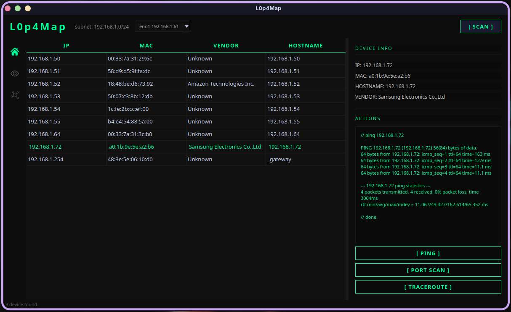
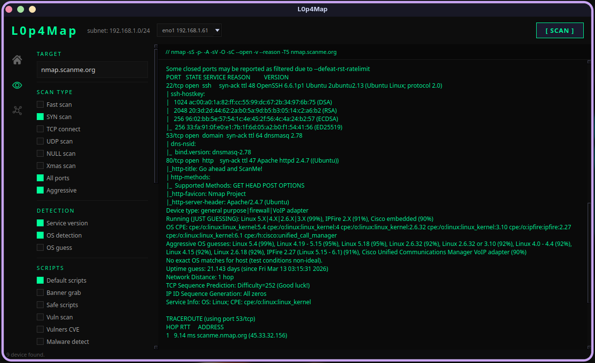
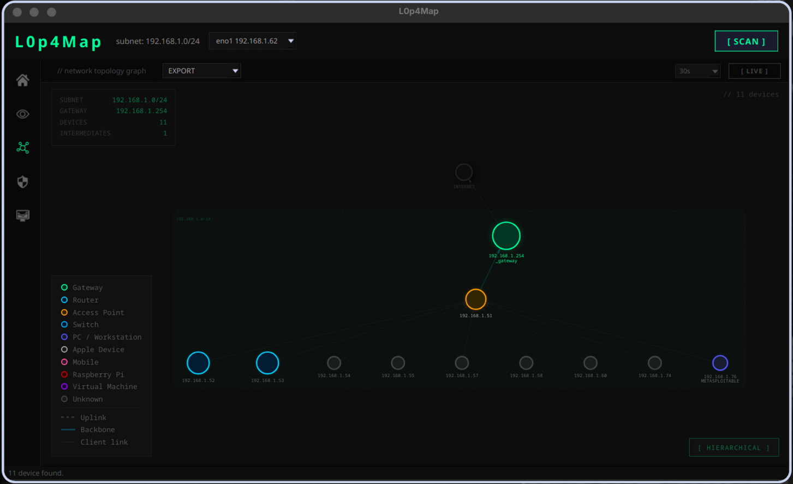
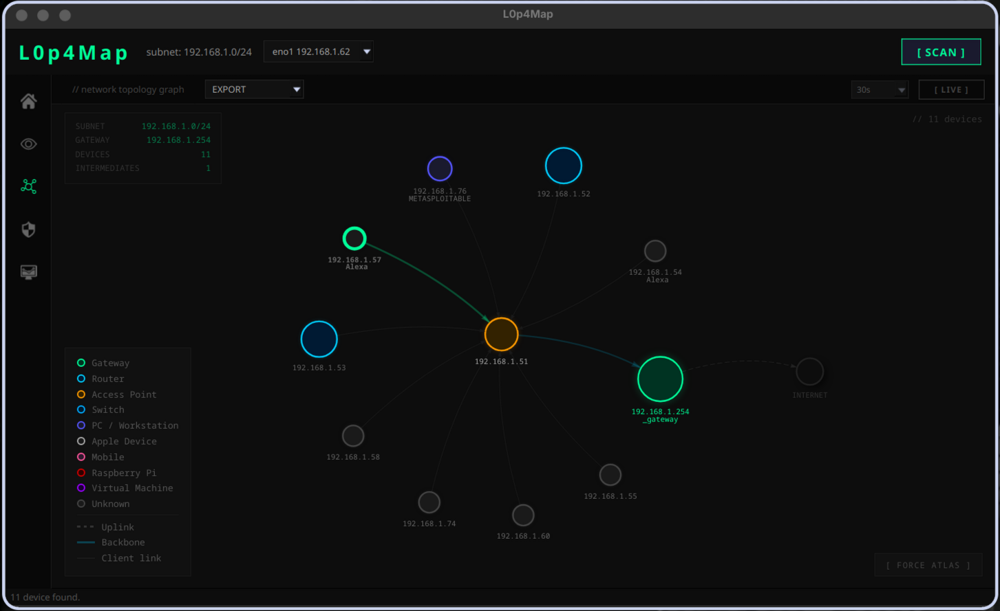
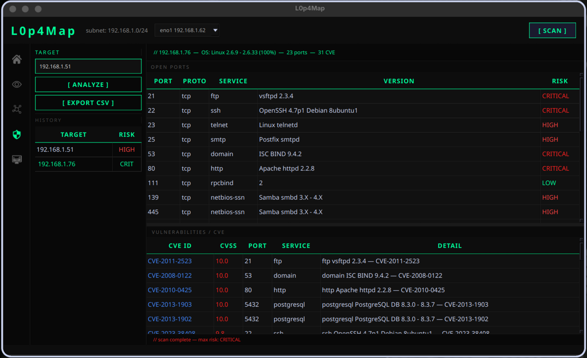
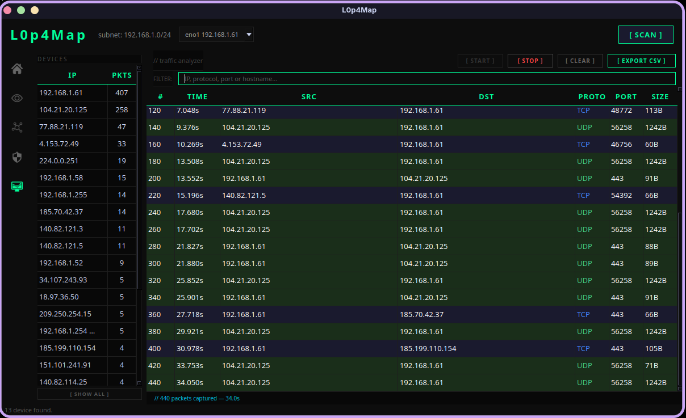

<div align="center">

# L0p4Map


**Nmap was blind. L0p4Map sees.**


Professional network monitoring & visualization tool built for security researchers.

https://github.com/user-attachments/assets/745eb888-0636-47e8-9293-38a706a8e897

</div>

---

## What is L0p4Map?

L0p4Map is a professional grade network monitoring tool that combines the power of nmap with a clean, modern dark UI. Designed for security researchers and network administrators who need fast, detailed visibility into their infrastructure.

No bloat. No BS. Just raw network intelligence.

Now available on Linux, Windows and macOS.

---

## Features

- **Multi-Platform Support**: works on Linux (Debian/Arch), Windows and macOS with the same interface and the same feature set
- **Continuous Monitoring**: lightweight daemon/agent that passively watches ARP and mDNS traffic without needing to rescan the whole network
- **Alerting**: real time notification when a new, unauthorized device appears on the network
- **Continuous SNMP Polling**: periodic SNMP queries to keep device status updated in real time, without waiting for the next scan cycle
- **ARP Network Scan**: fast host discovery with local IEEE OUI database lookup
- **Range Cartography**: scan any IP / CIDR / range. Routed ranges are mapped via traceroute (hosts grouped under their last hop router)
- **Hostname Resolution**: multi method detection via reverse DNS, NetBIOS (Windows) and mDNS/Avahi (Linux, Mac, IoT)
- **Device Fingerprinting**: TTL based OS hint (Linux/macOS, Windows, network device), TCP port probing on topology relevant ports, raw SNMP `sysDescr` query (no external libs)
- **Embedded Service Fingerprinting**: passively detects iLO / InfoPrint / XPort / SATO / Zebra via banner grabbing and flags them on the graph as devices known to ship with default credentials, for manual verification
- **Role Detection**: automatic classification of each host: gateway, router, access point, switch, PC, Apple, mobile, Raspberry Pi, virtual machine, unknown, combining vendor, hostname, TTL, open ports and SNMP response
- **Real Network Topology Graph**: hierarchical vis.js graph that reflects the actual network structure: gateway at the top, intermediate devices (routers/APs/switches) on a second tier, clients grouped below their parent. Toggleable between Hierarchical and Force Atlas layouts
- **Subnet Bounding Boxes**: each detected subnet is drawn as a dashed overlay directly on the graph canvas, labeled with its CIDR
- **Typed Edges**: three visually distinct link types: uplink (gateway to internet), backbone (intermediate device to gateway), client link (device to parent)
- **Topology Panel**: live overlay showing subnet, gateway IP, total devices and intermediate device count
- **Full nmap Integration**: SYN scan, UDP, OS detection, service version, NSE scripts
- **Banner Grabbing**: HTTP, SMB, FTP, SSH, SSL enumeration
- **Vulnerability Detection**: CVE lookup via vulners, vuln and malware scripts
- **Attack Surface**: exposed services, open ports and CVE overview per host with CVSS scoring and direct NVD link; results exportable as CSV
- **Traffic Analyzer**: real time packet capture with per device stats, protocol coloring, filter bar, double click to port scan; exportable as CSV
- **Traceroute**: ICMP based with real time output
- **Interface Selection**: choose which network interface to scan on
- **Live Monitoring**: auto refresh the network graph at configurable intervals (30s / 60s / 120s)
- **Scan Export**: save full nmap output to `.txt`
- **Graph Export**: export the network topology as CSV or PNG
- **Custom Node Labels**: assign custom names to any device directly on the graph (double click)
- **Dark Professional UI**: built with PyQt6

---

## Screenshots

### Home: Network Scanner


### Port Scan: Full nmap Integration


### Network Topology: Hierarchical topology graph


### Network Topology: Force Atlas layout


### Attack Surface: Exposed services, open ports and vulnerability overview


### Traffic Analyzer: Real-time network traffic analysis


---

## Requirements

### Linux (Debian or Arch)
- Python 3.11+
- nmap installed (`sudo pacman -S nmap` or `sudo apt install nmap`)
- Npcap/libpcap for packet capture (normally already present on Debian/Arch)
- Root privileges (required for ARP scanning and packet capture)

### Windows 10/11
- Python 3.11+
- Nmap for Windows (official installer from nmap.org, includes Npcap)
- Npcap installed in "WinPcap API-compatible" mode (required for packet capture)
- Run as Administrator (required for ARP scanning and packet capture)

### macOS (Intel and Apple Silicon)
- Python 3.11+
- nmap installed (`brew install nmap`)
- Root privileges (required for ARP scanning and packet capture)

---

## Installation

### Linux

**Arch Linux** users can install directly from the AUR:

```bash
yay -S l0p4map
```

Alternatively, on any Linux distribution:

```bash
git clone https://github.com/HaxL0p4/L0p4Map.git
cd L0p4Map
python3 -m venv venv
source venv/bin/activate
pip install -r requirements.txt
sudo chmod +x L0p4Map.sh
```

### macOS

```bash
git clone https://github.com/HaxL0p4/L0p4Map.git
cd L0p4Map
python3 -m venv venv
source venv/bin/activate
pip install -r requirements.txt
chmod +x L0p4Map.sh
```

### Windows

```powershell
git clone https://github.com/HaxL0p4/L0p4Map.git
cd L0p4Map
python -m venv venv
venv\Scripts\activate
pip install -r requirements.txt
```

Make sure nmap and Npcap are installed and available in the system PATH before launching the tool.

---

## Usage

### Linux and macOS

Launch the tool with root privileges:

```bash
sudo ./L0p4Map.sh
```

### Windows

Open a terminal (PowerShell or CMD) as Administrator, then:

```powershell
venv\Scripts\activate
python L0p4Map.py
```

### Workflow

1. Select the network interface from the toolbar dropdown
2. Press **[ SCAN ]** to discover all devices: each host is fingerprinted via TTL, port probing and SNMP
3. Click a device to see details and run quick actions (ping, traceroute, port scan)
4. Switch to **Graph** to explore the real network topology: hover nodes for full device info, double click to assign a custom label
5. Toggle between **[ HIERARCHICAL ]** and **[ FORCE ATLAS ]** layout from the graph view
6. Use **Attack Surface** to run a deep nmap + vulners scan on any host and review CVEs
7. Use **Traffic Analyzer** to capture live packets, filter by device or protocol, and export to CSV
8. Enable **[ LIVE ]** in the graph view to keep the topology updated automatically
9. Enable **Continuous Monitoring** to keep the agent passively listening on ARP/mDNS and receive alerts on new devices, without having to restart a full scan

---

## Legal Disclaimer

This tool is designed for **authorized network auditing only**. Only use L0p4Map on networks you own or have explicit permission to test. Unauthorized scanning is illegal.

---

## Author

**HaxL0p4**: [GitHub](https://github.com/HaxL0p4)

---
